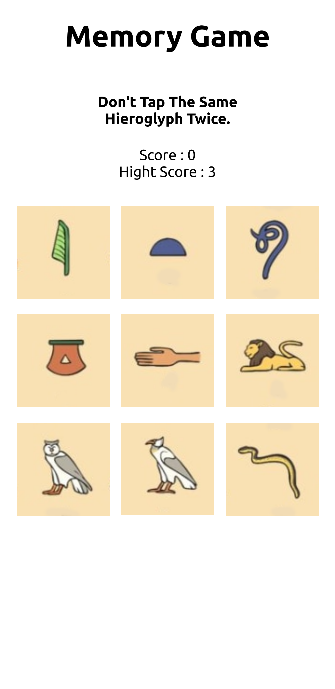

[![Contributors][contributors-shield]][contributors-url]
[![Forks][forks-shield]][forks-url]
[![Stargazers][stars-shield]][stars-url]
[![Issues][issues-shield]][issues-url]

<!-- PROJECT LOGO -->
 

  

<h3 align="center">memory game</h3>

  

    project_description
     
    <a href="https://github.com/sirjamo1/sirjamo1"><strong>Explore the docs »</strong></a>
     
     
    <a href="http://sirjamo1.github.io/memory-game">View Demo</a>
    ·
    <a href="https://github.com/sirjamo1/sirjamo1/issues">Report Bug</a>
    ·
    <a href="https://github.com/sirjamo1/sirjamo1/issues">Request Feature</a>
  

<!-- TABLE OF CONTENTS -->

  
Table of Contents

  <ol>
    <li>
      <a href="#about-the-project">About The Project</a>
      <ul>
        <li><a href="#built-with">Built With</a></li>
      </ul>
    </li>
    <li><a href="#usage">Usage</a></li>
    <li><a href="#contact">Contact</a></li>
    <li><a href="#acknowledgments">Acknowledgments</a></li>
  </ol>

<!-- ABOUT THE PROJECT -->

## About The Project

Memory Game created for The Odin Project

<a href="http://sirjamo1.github.io/memory-game">View Demo</a>

Assignment

<ol>
<li>Create a new project using create-react-app.</li>
<li>Take a little bit of time to think about how you want to implement your application, the features you want to implement, which components you need, and how to structure your application. Your application should include a scoreboard, which counts the current score, and a “Best Score”, which shows the best score you achieved thus far. You also need a couple of cards that display images and possibly informational text. There should be a function that displays the cards in a random order anytime a user clicks one. Be sure to invoke that function when the component mounts.</li>
<li>Now that you’ve thought about the structure of your application, set up the folder structure and start creating the components. We suggest you use functional components and therefore hooks in this project.</li>
<li>Style your application so you can show it off!</li>
<li>As always, push the project to GitHub.</li>
</ol>

(<a href="#readme-top">back to top</a>)

### Built With

-   [![React][react.js]][react-url]

<!-- CONTACT -->

## Contact

James Howells -jam_how@hotmail.com

Project Link: [https://github.com/sirjamo1/sirjamo1](https://github.com/sirjamo1/sirjamo1)

(<a href="#readme-top">back to top</a>)

<!-- ACKNOWLEDGMENTS -->

## Acknowledgments

-   background/ images where taken from https://www.twinkl.com.au/

(<a href="#readme-top">back to top</a>)

<!-- MARKDOWN LINKS & IMAGES -->
<!-- https://www.markdownguide.org/basic-syntax/#reference-style-links -->

[contributors-shield]: https://img.shields.io/github/contributors/sirjamo1/sirjamo1.svg?style=for-the-badge
[contributors-url]: https://github.com/sirjamo1/sirjamo1/graphs/contributors
[forks-shield]: https://img.shields.io/github/forks/sirjamo1/sirjamo1.svg?style=for-the-badge
[forks-url]: https://github.com/sirjamo1/sirjamo1/network/members
[stars-shield]: https://img.shields.io/github/stars/sirjamo1/sirjamo1.svg?style=for-the-badge
[stars-url]: https://github.com/sirjamo1/sirjamo1/stargazers
[issues-shield]: https://img.shields.io/github/issues/sirjamo1/sirjamo1.svg?style=for-the-badge
[issues-url]: https://github.com/sirjamo1/sirjamo1/issues
[license-shield]: https://img.shields.io/github/license/sirjamo1/sirjamo1.svg?style=for-the-badge
[license-url]: https://github.com/sirjamo1/sirjamo1/blob/master/LICENSE.txt
[linkedin-shield]: https://img.shields.io/badge/-LinkedIn-black.svg?style=for-the-badge&logo=linkedin&colorB=555
[linkedin-url]: https://linkedin.com/in/linkedin_username
[product-screenshot]: images/screenshot.png
[next.js]: https://img.shields.io/badge/next.js-000000?style=for-the-badge&logo=nextdotjs&logoColor=white
[next-url]: https://nextjs.org/
[react.js]: https://img.shields.io/badge/React-20232A?style=for-the-badge&logo=react&logoColor=61DAFB
[react-url]: https://reactjs.org/
[vue.js]: https://img.shields.io/badge/Vue.js-35495E?style=for-the-badge&logo=vuedotjs&logoColor=4FC08D
[vue-url]: https://vuejs.org/
[angular.io]: https://img.shields.io/badge/Angular-DD0031?style=for-the-badge&logo=angular&logoColor=white
[angular-url]: https://angular.io/
[svelte.dev]: https://img.shields.io/badge/Svelte-4A4A55?style=for-the-badge&logo=svelte&logoColor=FF3E00
[svelte-url]: https://svelte.dev/
[laravel.com]: https://img.shields.io/badge/Laravel-FF2D20?style=for-the-badge&logo=laravel&logoColor=white
[laravel-url]: https://laravel.com
[bootstrap.com]: https://img.shields.io/badge/Bootstrap-563D7C?style=for-the-badge&logo=bootstrap&logoColor=white
[bootstrap-url]: https://getbootstrap.com
[jquery.com]: https://img.shields.io/badge/jQuery-0769AD?style=for-the-badge&logo=jquery&logoColor=white
[jquery-url]: https://jquery.com
